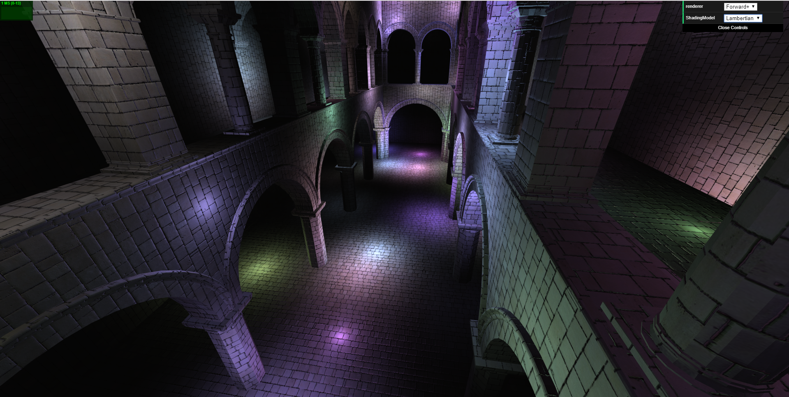
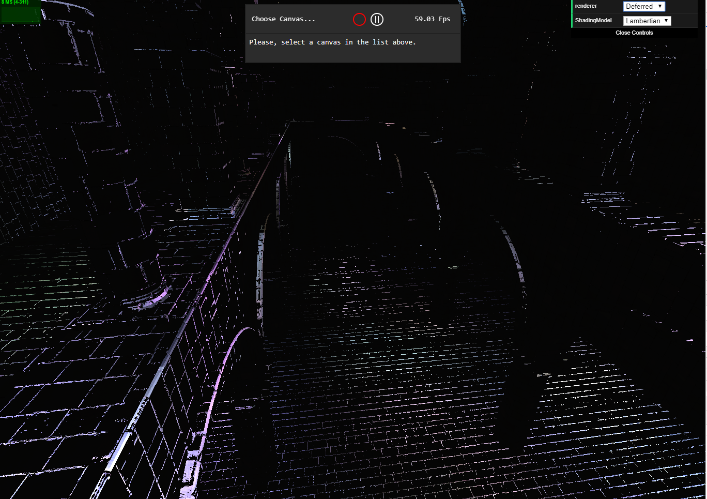

WebGL Clustered and Forward+ Shading
======================

**University of Pennsylvania, CIS 565: GPU Programming and Architecture, Project 5**

* Eric Micallef
  * https://www.linkedin.com/in/eric-micallef-99291714b/
  
* Tested on: Windows 10, i5, Nvidia GTX1660 (Personal)

- [Live Online](#Live-Online)
- [Demo Video](#Demo-Video)
- [Overview](#Overview)
  - [Forward](#Forward)
  - [Forward+](#Forward+)
  - [Deferred](#Deferred)
- [Effects](#Effects)
    - [Lambert](#Lambert)
    - [BlinnPhong](#BlinnPhong)
- [Optimization](#Optimization)
  - [G-Buffer](#G-Buffer)
- [Debilitating Bugs/Bloopers](#Debilitating-Bugs-AKA-Bloopers-In-CIS565-World)
- [Bugs](#Bugs)
- [Resources](#Resources)
- [Credits](#Credits)

# Live Online

[](http://TODO.github.io/Project5B-WebGL-Deferred-Shading)

# Demo Video

[](TODO)

# Overview

In its basic form, forward shading is a method of rendering scenes by linearly marching forward along the GPU pipeline. For each mesh and light combination we issue a single draw call additively blending the results until the image has been fully assembled. The pseduo code below helps depict the algorithm at a high level.

## Forward

In its basic form, forward shading is a method of rendering scenes by linearly marching forward along the GPU pipeline. For each mesh and light combination we issue a single draw call additively blending the results until the image has been fully assembled. The pseduo code below helps depict the algorithm at a high level.

```C
//Shaders:
Shader simpleShader

//Buffers:
Buffer display

for mesh in scene
    for light in scene
        display += simpleShader(mesh, light)
```

## Forward+

The forward+ technique invovles culling lights or a "cluster/tiling" approach and then shading. By performing the culling stage we can intellignetly light our scene.

```C
//Buffers:
Buffer display
Buffer tileArray

//Shaders:
Shader manyLightShader

//Light culling
for tile in tileArray
   for light in scene
      if lightInTile(tile, light)
          tile += light
      
for tile in scene
        display += simpleShader(tile, light)

```


## Deferred


The idea behind deferred shading is that we perform all visibility and material fetching in one shader program, store the result in a buffer, and then we defer lighting and shading to another shader that takes as an input that buffer. Our "buffer" we store into is commonly known as a "Gbuffer". The contents and size of a Gbuffer will typically range. As some designers implement Gbuffers based on the task at hand or or clever the designer is at packing data. The basic pseudo code for Deferred shading is below.
In our deferred method we also use the tiling approach.

```C
//Buffers:
Buffer display
Buffer GBuffer 
Buffer tileArray

//Shaders:
Shader manyLightShader
Shader writeShadingAttributes
CompShader lightInTile

//Visibility & materials
for mesh in scene
    if mesh.depth < GBuffer.depth
       GBuffer = writeShadingAttributes(mesh)

//Light culling
for tile in tileArray
   for light in scene
      if lightInTile(tile, light)
          tile += light
      
//Shading
display = manyLightShader(GBuffer, tileArray)
```


# Effects

Our basic shader comes with the typical lambert style shading. Upon this I added the blinn phong shader to make our dungeon look like a sick trap house.

There was no performance impact between the two. The blinnphong model vs the lambert model in my code was only a few extra lines of computational code which is likely masked away.

## Lambert

In the lambert shading 



## BlinnPhong

Notice how with the blinnphong model you can almost hear da rudes sandstorm playing in the background... 

https://www.youtube.com/watch?v=y6120QOlsfU

https://genius.com/1780629

```
Duuuuuuuuuuuuuuuuuuuuuuun
Dun dun dun dun dun dun dun dun dun dun dun dundun dun dundundun dun dun dun dun dun dun dundun dundun
BOOM
Dundun dundun dundun
BEEP
Dun dun dun dun dun
Dun dun
BEEP BEEP BEEP BEEP
BEEEP BEEP BEEP BEEP
BEEP BEEP BEEP BEEP BEEP BEEP BEEP BEEP BEEP BEEP BOOM
Daddaddadadsadadadadadadadadadaddadadadadadaddadadaddadadadadadadadadadadadaddadddadaddadadadd dadadadaddaddada
```


# Optimizations

## packing our Gbuffer


Reducing the number of g-buffers helps make deferred shading faster which can be done by compactly storing data in them. Colors often dont need the alpha component, normals can be reconstructed simply from 2 of their components, data can be stored in 24bit floats instead of 32 bits, are just some of the ways to achieve this compression.

This project implemented the following layout for the 2 g-buffers used:


| R-Channel       | G-Channel     | B-Channel      | A-Channel       |
| :-------------: |:-------------:| :-------------:| :-------------: | 
| position_x      | position_y    | position_z     | normal_x        |
| color_x         | color_y       |   color_z      | normal_y        |


2 Component Normals

We can reconstruct the z-value of the normal from its x and y values. The magnitude of a vector is defined as the ```square root of x^2 + y^2 + z^2```. This formula gives us the magnitude of z. The sign of z is positive in camera space for all the fragments that we can see. Using this information I was somehow able to recronstruct our scene appropritately without too much pain.

# Debilitating Bugs AKA Bloopers In CIS565 World

below is what happens when your normals are off by a bit ):.
In this scene I have 250 lights but it still quite dark.




# Bugs

All programs are filled with bugs. On one hand atleast mine is known? When the number of lights increases > 300. my AABB boxes seem to be appearing every where. Could never unfortunately fix in time.


Compare your implementations of Forward+ and Clustered shading and analyze their differences.
  - Is one of them faster?
  - Is one of them better at certain types of workloads?
  - What are the benefits and tradeoffs of using one over the other?
  - For any differences in performance, briefly explain what may be causing the difference.

For each new effect feature (required or extra), please provide the following analysis:
  - Concise overview write-up of the feature.
  - Performance change due to adding the feature.
  - If applicable, how do parameters (such as number of lights, etc.) affect performance? Show data with simple graphs.
    - Show timing in milliseconds, not FPS.
  - If you did something to accelerate the feature, what did you do and why?
  - How might this feature be optimized beyond your current implementation?

For each performance feature (required or extra), please provide:
  - Concise overview write-up of the feature.
  - Detailed performance improvement analysis of adding the feature
    - What is the best case scenario for your performance improvement? What is the worst? Explain briefly.
    - Are there tradeoffs to this performance feature? Explain briefly.
    - How do parameters (such as number of lights, tile size, etc.) affect performance? Show data with graphs.
      - Show timing in milliseconds, not FPS.
    - Show debug views when possible.
      - If the debug view correlates with performance, explain how.


# Resources

explanation of forward plus
https://takahiroharada.files.wordpress.com/2015/04/forward_plus.pdf

helping fix a culling bug
https://www.gamedevs.org/uploads/fast-extraction-viewing-frustum-planes-from-world-view-projection-matrix.pdf

for helping me understand what I am even supposed to be doing. Also for recreation of readme overviews.
http://www.aortiz.me/2018/12/21/CG.html

helping with normals
https://www.gamasutra.com/blogs/RobertBasler/20131122/205462/Three_Normal_Mapping_Techniques_Explained_For_the_Mathematically_Uninclined.php?print=1

blinn phong
https://en.wikipedia.org/wiki/Blinn%E2%80%93Phong_reflection_model

for world view matrices, blinn phong and alot of other concepts used for basic shading
https://github.com/micallef25/Project5-DirectX-Procedural-Raytracing

# Credits

* [Three.js](https://github.com/mrdoob/three.js) by [@mrdoob](https://github.com/mrdoob) and contributors
* [stats.js](https://github.com/mrdoob/stats.js) by [@mrdoob](https://github.com/mrdoob) and contributors
* [webgl-debug](https://github.com/KhronosGroup/WebGLDeveloperTools) by Khronos Group Inc.
* [glMatrix](https://github.com/toji/gl-matrix) by [@toji](https://github.com/toji) and contributors
* [minimal-gltf-loader](https://github.com/shrekshao/minimal-gltf-loader) by [@shrekshao](https://github.com/shrekshao)
